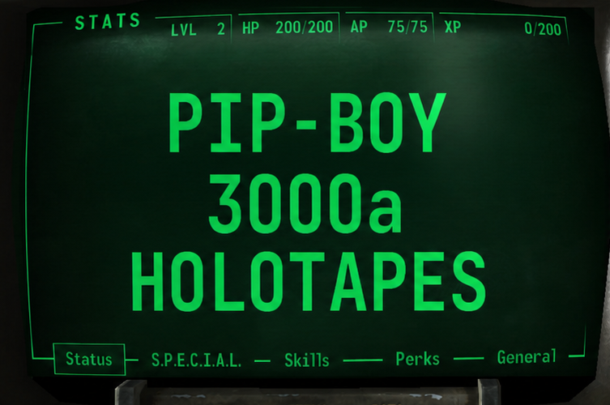

<div align="center">
  
  <h1 align="center">Pip-Boy 3000a Holotapes</h1>
  <p align="center">
    A community driven repository of custom applications and games for the 
    <a href="https://www.thewandcompany.com/pip-boy-3000/" target="_blank">Pip-Boy 3000a</a>, 
    hosted on <a href="https://www.pip-boy.com/" target="_blank">pip-boy.com</a>.
  </p>
  <p align="center">
    <a href="https://pip-boy.com" target="_blank">
      Pip-Boy.com
    </a>&nbsp;|&nbsp;
    <a href="https://discord.com/invite/zQmAkEg8XG" target="_blank">
      Discord Community
    </a>&nbsp;|&nbsp;
    <a href="https://gear.bethesda.net/products/fallout-pip-boy-3000-replica" target="_blank">
      Bethesda Store
    </a>&nbsp;|&nbsp;
    <a href="https://www.thewandcompany.com">
      The Wand Company
    </a>&nbsp;|&nbsp;
    <a href="https://www.espruino.com" target="_blank">
      Espruino
    </a>
  </p>
</div>

<!---------------------------------------------------------------------------->
<!---------------------------------------------------------------------------->
<!---------------------------------------------------------------------------->

## Index <a name="index"></a>

- [Description](#description)
- [Prerequisites](#prerequisites)
- [Create a New App or Game](#create-a-new-app-or-game)
- [Testing](#testing)
- [Contributing](#contributing)
- [License](#license)
- [Wrapping Up](#wrapping-up)

<!---------------------------------------------------------------------------->
<!---------------------------------------------------------------------------->
<!---------------------------------------------------------------------------->

## Description <a name="description"></a>

Welcome to the Pip-Boy 3000a Holotape repository.

This is a community driven collection of custom apps, games, and other software 
built for the Pip-Boy 3000a, the wearable device created by Bethesda and The Wand
Company.

The holotapes in this repository are provided for easy installation on
[pip-boy.com](https://pip-boy.com).

<p align="right">[ <a href="#index">Index</a> ]</p>

<!---------------------------------------------------------------------------->
<!---------------------------------------------------------------------------->
<!---------------------------------------------------------------------------->

## Prerequisites <a name="prerequisites"></a>

- An IDE for making changes to the codebase (e.g. [Visual Studio
  Code][link-vs-code]).
- TODO

<p align="right">[ <a href="#index">Index</a> ]</p>

<!---------------------------------------------------------------------------->
<!---------------------------------------------------------------------------->
<!---------------------------------------------------------------------------->

## Create a New App or Game <a name="create-a-new-app-or-game"></a>

TODO

<p align="right">[ <a href="#index">Index</a> ]</p>

<!---------------------------------------------------------------------------->
<!---------------------------------------------------------------------------->
<!---------------------------------------------------------------------------->

## Testing <a name="testing"></a>

TODO

<p align="right">[ <a href="#index">Index</a> ]</p>

<!---------------------------------------------------------------------------->
<!---------------------------------------------------------------------------->
<!---------------------------------------------------------------------------->

## Contributing <a name="contributing"></a>

1.  Clone the repository and create a new branch for your changes:

    ```sh
    git clone https://github.com/CodyTolene/pip-boy-3000a-holotapes.git
    ```

2.  Create a new branch for your changes:

    ```sh
    git checkout -b your-feature-branch
    ```

3.  Make your changes to the codebase.

4.  Add and commit your changes:

    ```sh
    git add .
    git commit -m "Your commit message"
    ```

5.  Push your changes:

    ```sh
    git push origin your-feature-branch
    ```

6.  Create a pull request on GitHub to merge your changes into the main branch:

    https://github.com/CodyTolene/pip-boy-3000a-holotapes/pulls

<p align="right">[ <a href="#index">Index</a> ]</p>

<!---------------------------------------------------------------------------->
<!---------------------------------------------------------------------------->
<!---------------------------------------------------------------------------->

## License <a name="license"></a>

This project is licensed under the MIT License.

Some projects in this repository may have their own licenses. Check each
app or game's individual files and README for license terms that apply to that
specific project.

See the [LICENSE-MIT](LICENSE-MIT) file for more details.

`SPDX-License-Identifiers: MIT`

<p align="right">[ <a href="#index">Index</a> ]</p>

<!---------------------------------------------------------------------------->
<!---------------------------------------------------------------------------->
<!---------------------------------------------------------------------------->

## Wrapping Up <a name="wrapping-up"></a>

Thank you to Bethesda & The Wand Company for such a fun device to tinker with!
If you have any questions, please let me know by opening an issue
[here][link-new-issue].

Cody Tolene

<p align="right">[ <a href="#index">Index</a> ]</p>

<!---------------------------------------------------------------------------->
<!---------------------------------------------------------------------------->
<!---------------------------------------------------------------------------->

<!-- IMAGE REFERENCES -->

[img-info]: .github/images/ng-icons/info.svg
[img-warn]: .github/images/ng-icons/warn.svg

<!-- LINK REFERENCES -->

[link-new-issue]:
  https://github.com/CodyTolene/pip-boy-3000a-holotapes/issues/new
[link-node-js]: https://nodejs.org/en
[link-vs-code]: https://code.visualstudio.com/
