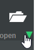
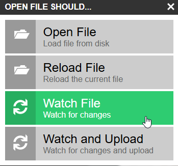

<div align="center">
  
  <h1 align="center">Pip-Boy 3000a Holotapes</h1>
  <p align="center">
    A community driven repository of custom applications and games for the 
    <a href="https://www.thewandcompany.com/pip-boy-3000/" target="_blank">Pip-Boy 3000a</a>, 
    hosted on <a href="https://www.pip-boy.com/" target="_blank">pip-boy.com</a>.
  </p>
  <p align="center">
    <a href="https://pip-boy.com" target="_blank">
      Pip-Boy.com
    </a>&nbsp;|&nbsp;
    <a href="https://discord.com/invite/zQmAkEg8XG" target="_blank">
      Discord Community
    </a>&nbsp;|&nbsp;
    <a href="https://gear.bethesda.net/products/fallout-pip-boy-3000-replica" target="_blank">
      Bethesda Store
    </a>&nbsp;|&nbsp;
    <a href="https://www.thewandcompany.com">
      The Wand Company
    </a>&nbsp;|&nbsp;
    <a href="https://www.espruino.com" target="_blank">
      Espruino
    </a>|&nbsp;
    <a href="https://log.robco-industries.org/" target="_blank">
      RobCo Industries
    </a>
  </p>
</div>

<!---------------------------------------------------------------------------->
<!---------------------------------------------------------------------------->
<!---------------------------------------------------------------------------->

## Index <a name="index"></a>

- [Description](#description)
- [Creating a new Holotape](#create)
- [Development Workflow](#development)
- [Images](#images)
- [Input handling](#input)
- [Memory and Performance](#memory)
- [Contributing](#contributing)
- [License(s)](#licenses)

<!---------------------------------------------------------------------------->
<!---------------------------------------------------------------------------->
<!---------------------------------------------------------------------------->

## Description <a name="description"></a>

Pip-Boy 3000a Holotapes by the community, for the community.

Install on: [pip-boy.com][link-pip-boy]

Follow the guide below to create your own custom Holotapes for the Pip-Boy 
3000a!

<p align="right">[ <a href="#index">Index</a> ]</p>

<!---------------------------------------------------------------------------->
<!---------------------------------------------------------------------------->
<!---------------------------------------------------------------------------->

## Creating a new Holotape <a name="create"></a>

1. Create a new folder in the `holotapes` directory for your app or game.

2. Add a `README.md` file with a description of your app or game, installation
   instructions, and any other relevant information within.

3. Add a `ChangeLog` file to track changes and updates to your app or game.

5. Add your app or game's code files to the folder. Example `app.js` file:

    ```js
    (function () {
      h.clear();

      const appId = 'APPID';
      const intervalId = setInterval(tick, 1000);

      function tick() {
        h.clear();
        h.setFontAlign(0, 0).drawString('Piptris', 160, 120);
      }

      function onKnob1(direction) {
        // Handle knob
      }

      Pip.onExclusive('knob1', onKnob1);

      tick();

      return {
        id: appId,
        notDefault: true,
        fullscreen: true,
        remove: function () {
          Pip.removeListener('knob1', onKnob1);
          clearInterval(intervalId);
          Pip.audioStop();
          h.clear();
        },
      };
    });
    ```

<!--- TODO: Add more details) -->

<p align="right">[ <a href="#index">Index</a> ]</p>

<!---------------------------------------------------------------------------->
<!---------------------------------------------------------------------------->
<!---------------------------------------------------------------------------->

## Development Workflow <a name="development"></a>

1. Open the Espruino Web IDE

   https://www.espruino.com/ide/

   or

   https://espruino.github.io/EspruinoWebIDE

2. Give a shoutout to Gordon Williams and the Espruino team!

   https://www.patreon.com/espruino

3. Open your file:

    

4. Enable **Watch File**

    

5. Edit the app in VS Code (or the web IDE's built in editor).

6. Enable "Settings" > "Minification" > "Esprima: Mangle"

7. Set "Settings" > "Minification" > "Pretokenise code before upload" to Yes/Always. 

8. Upload to the device for testing.

> ![img-info][img-info] You can use a boot code file to boot straight into the app.

<p align="right">[ <a href="#index">Index</a> ]</p>

<!---------------------------------------------------------------------------->
<!---------------------------------------------------------------------------->
<!---------------------------------------------------------------------------->

## Images <a name="images"></a>

Image data:

```js
// HOLO/MYAPP/IMG.JS
({
  block: atob('...'),
  nuke: atob('...'),
})
```

Load image data:

```js
const sprites = eval(require('fs').readFileSync('HOLO/MYAPP/IMG.JS'));
h.drawImage(sprites.nuke, 120, 80);
```

<p align="right">[ <a href="#index">Index</a> ]</p>

<!---------------------------------------------------------------------------->
<!---------------------------------------------------------------------------->
<!---------------------------------------------------------------------------->

## Input handling <a name="input"></a>

Use `Pip.onExclusive()` when an app needs exclusive control input handling:

```js
function onKnob1(direction) {}
function onKnob2(direction) {}

Pip.onExclusive('knob1', onKnob1);
Pip.onExclusive('knob2', onKnob2);
```

Remove the listeners when the app exits:

```js
Pip.removeListener('knob1', onKnob1);
Pip.removeListener('knob2', onKnob2);
```

<p align="right">[ <a href="#index">Index</a> ]</p>

<!---------------------------------------------------------------------------->
<!---------------------------------------------------------------------------->
<!---------------------------------------------------------------------------->

## Memory and Performance <a name="memory"></a> 

Main rules:

  - keep the app scoped:
    ```js
    (function () {
      // App code here
      // ...
      // Return this object
      return {
        id: 'APPID',
        notDefault: true,
        fullscreen: true,
        remove: function () { ... },
      };
    });
    ```

  - Clean up in `remove()`, ie:
      ```js
      remove: function () {
        Pip.removeListener('knob1', onKnob1);
        clearInterval(intervalId);
        Pip.audioStop();
        h.clear();
      },
      ```

Notes:

- The 3000a has about `6500` Espruino variable blocks available to JavaScript.
- Once an app is running, the OS uses around `1700`, leaving about `4600` for 
  the app.
- For example, Atomic Command was mentioned as using around `3000`.
- Avoid deleting OS globals or built in menus just to save memory. It may work, 
  but it can also break returning to the Pip-Boy OS.

Useful memory checks:

```js
process.memory();
print(E.getSizeOf(this, 1).sort((a, b) => a.size - b.size));
print(E.getSizeOf(Pip, 1).sort((a, b) => a.size - b.size));
print(E.getSizeOf(this['\xFF'], 1).sort((a, b) => a.size - b.size));
```

`this['\xFF']` to see timers, watches, internal runtime state. 

`Pip.CURRENT` can hold the current page or app code.

<p align="right">[ <a href="#index">Index</a> ]</p>

<!---------------------------------------------------------------------------->
<!---------------------------------------------------------------------------->
<!---------------------------------------------------------------------------->

## Contributing <a name="contributing"></a>

1.  Fork the repository:

    https://github.com/CodyTolene/pip-boy-3000a-holotapes/fork

2.  Clone your forked repository:
    ```sh
    git clone https://github.com/<my-username>/pip-boy-3000a-holotapes.git
    ```
    > ![Info][img-info] Replace `<my-username>` with your own GitHub username.

3.  Create a new branch for your changes:

    ```sh
    git checkout -b your-feature-branch
    ```

4.  Make your changes to the codebase.

5.  Add and commit your changes:

    ```sh
    git add .
    git commit -m "Your commit message"
    ```

6.  Push your changes:

    ```sh
    git push origin your-feature-branch
    ```

7. Before opening a pull request, give your Holotape one last cleanup pass:

    - Wrap the app in a function expression.
    - Return an object with `id` and `remove`.
    - Use `h` for graphics.
    - Avoid `var` and unnecessary globals.
    - Clean up everything in `remove()`:
      - listeners
      - timeouts
      - intervals
      - watches
      - audio
    - Keep sprites and images small.
    - Test that the app can exit without rebooting.
    - Test opening and closing the app more than once.
    - Check memory before and after exiting.
    - Document the controls and firmware version tested.

8.  Create a pull request on GitHub to merge your changes into the main branch:

    https://github.com/CodyTolene/pip-boy-3000a-holotapes/pulls

<p align="right">[ <a href="#index">Index</a> ]</p>

<!---------------------------------------------------------------------------->
<!---------------------------------------------------------------------------->
<!---------------------------------------------------------------------------->

## License(s) <a name="licenses"></a>

This project is licensed under the MIT License.

Some projects in this repository may have their own licenses. Check each
app or game's individual files and README for license terms that apply to that
specific project.

See the [LICENSE-MIT](LICENSE-MIT) file for more details.

`SPDX-License-Identifiers: MIT`

<p align="right">[ <a href="#index">Index</a> ]</p>

<!---------------------------------------------------------------------------->
<!---------------------------------------------------------------------------->
<!---------------------------------------------------------------------------->

<!-- IMAGE REFERENCES -->

[img-info]: .github/images/ng-icons/info.svg
[img-warn]: .github/images/ng-icons/warn.svg

<!-- LINK REFERENCES -->

[link-pip-boy]: https://pip-boy.com
